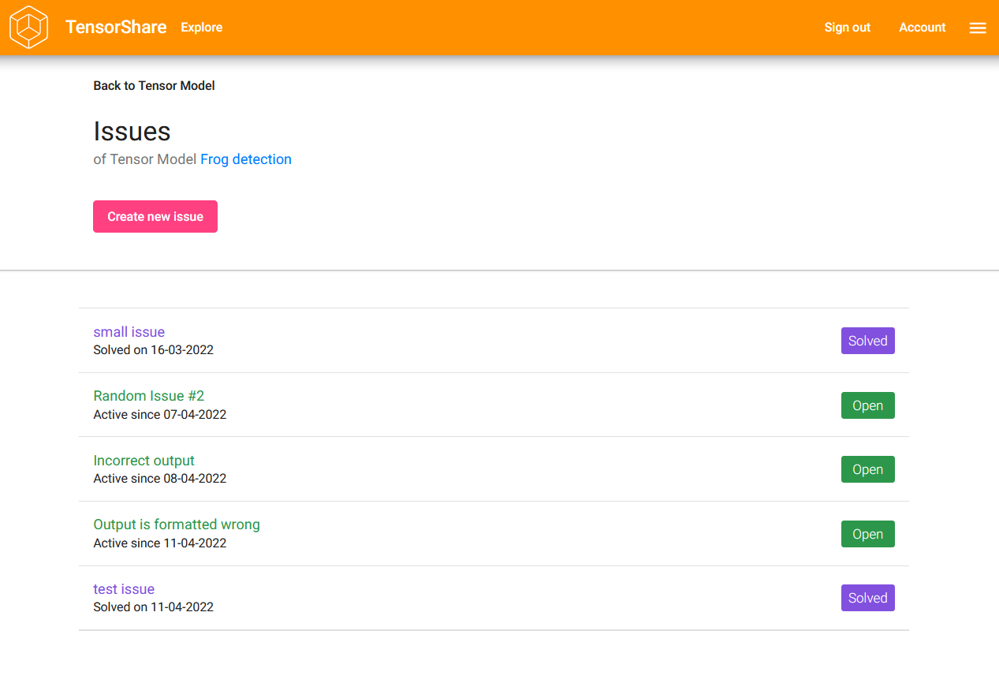

# Tensor Share

Tensor Share is a platform where users can share their ML models, solve issues and discuss.

## CRUD components
- Tensor Model
- Comment
- Issue

## Screenshots

### Homepage

### Login

### Account page with your created Tensor Models

### Explore page

### Tensor Model Details

### Comments of Tensor Model

### Issues of a Tensor Model

### Issue Details
